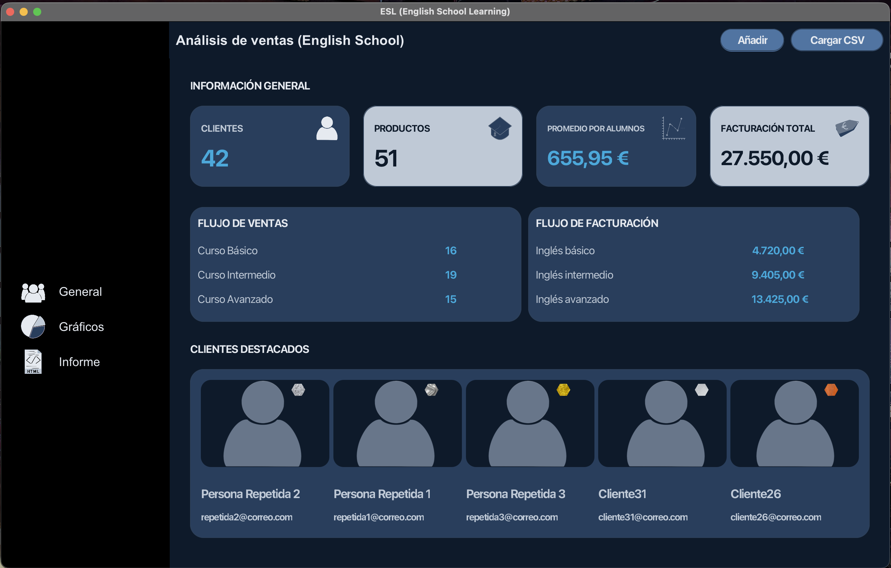
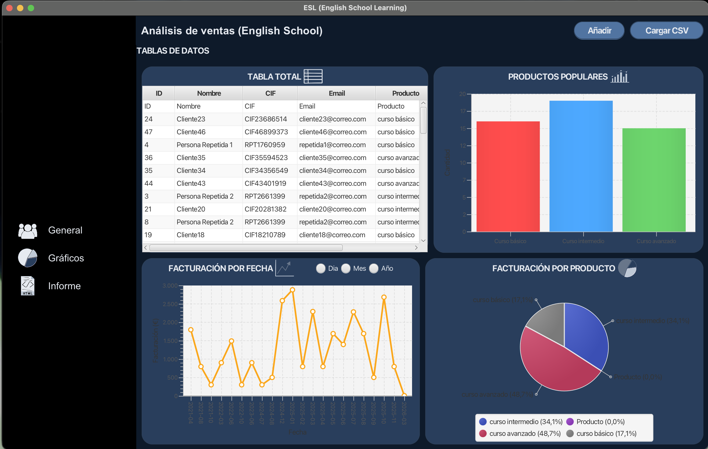
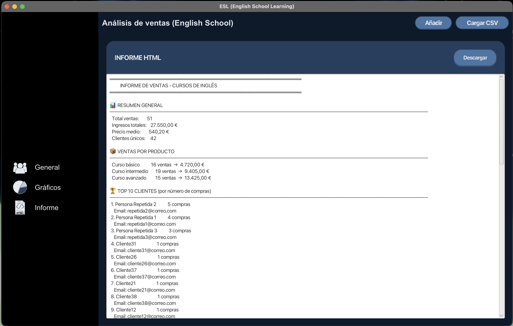
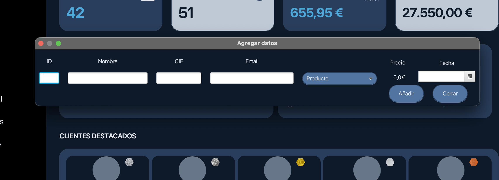

# 📊 Gestión de Ventas - English School (Proyecto Personal)

Este es un proyecto desarrollado para poner en práctica la integración de **Java 21** y **JavaFX** mediante el uso de **Maven**. El objetivo principal fue crear una interfaz funcional que permita visualizar y organizar los datos de ventas de una academia de idiomas de forma sencilla y clara.

## ✨ Funcionalidades implementadas

### 1. Panel de Visualización (Dashboard)
Una vista general para seguir el estado de la academia:
* **Métricas básicas:** Conteo de alumnos, productos y facturación total acumulada.
* **Resumen por niveles:** Listado de ventas separadas por cursos (Básico, Intermedio y Avanzado).
* **Clasificación de alumnos:** Visualización de clientes mediante un sistema de etiquetas (Diamante, Oro, etc.) basado en su actividad.

### 2. Gráficos y Tablas
Uso de componentes visuales de JavaFX para representar la información:
* **Gráficos dinámicos:** Representación de la evolución de ventas por fechas y popularidad de los cursos.
* **Gestión de datos:** Tabla interactiva para revisar el listado completo de transacciones.

### 3. Utilidades de Datos
* **Importación:** Carga de datos externos mediante archivos **CSV**.
* **Formularios:** Ventana modal para añadir manualmente nuevos registros al sistema.
* **Exportación:** Generación de un reporte básico en formato **HTML**.

---

## 📸 Capturas de Pantalla

<details>
  <summary>Ver imágenes de la aplicación</summary>
  <br>
  
  ### Vista del Dashboard
  
  *Resumen de métricas y flujo de ventas por niveles.*

  ### Gráficos de Análisis
  
  *Visualización de tendencias y comparativa de productos.*

  ### Reporte HTML
  
  *Ejemplo del informe generado por la aplicación.*

  ### Formulario de entrada
  
  *Ventana para agregar nuevos datos manualmente.*

</details>

---

## 🛠️ Tecnologías utilizadas

* **Java 21:** Uso de las últimas versiones de soporte a largo plazo (LTS).
* **JavaFX:** Creación de la interfaz mediante archivos FXML y estilos CSS.
* **Maven:** Gestión de dependencias y construcción del proyecto.

## 🚀 Cómo ejecutar el proyecto

1. **Clonar el repositorio:**
   ```bash
   git clone [https://github.com/Diejandro/analisis-ventas-javafx.git](https://github.com/Diejandro/analisis-ventas-javafx.git)

---

## 🎨 Créditos y Licencia

* **Código:** Distribuido bajo la Licencia MIT. Consulta el archivo `LICENSE` para más detalles.
* **Diseño e Iconografía:** Todos los iconos de la interfaz (`.png`) han sido creados manualmente por el autor para este proyecto.
